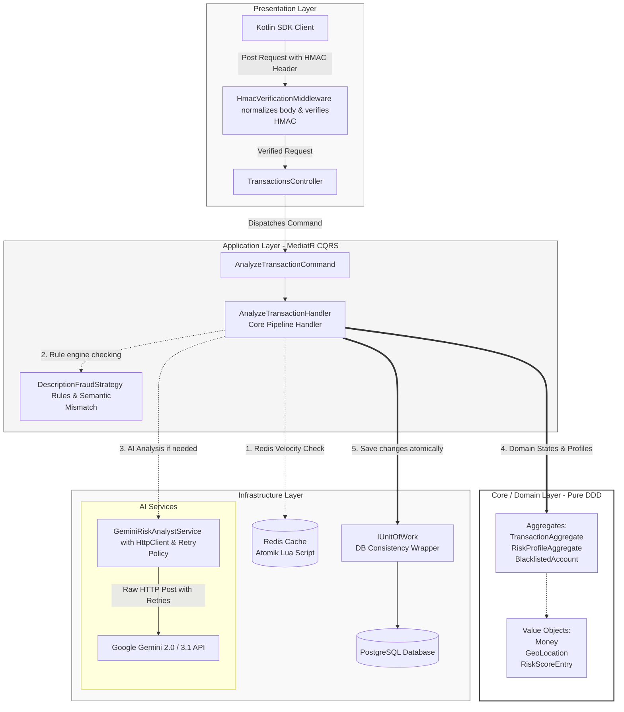
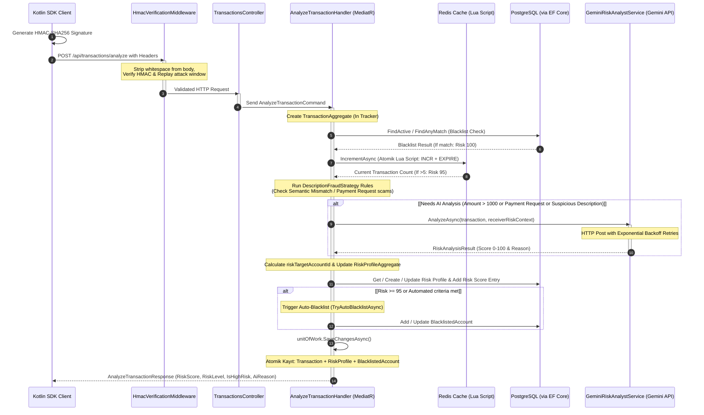

# SenseFin SDK & Backend 🛡️🤖


SenseFin is an advanced, AI-powered fraud detection system and mobile SDK backend designed to evaluate transaction risks in real-time. Built with a modern **Clean Architecture** approach on **.NET 9**, it leverages **Google's Gemini LLM** to analyze behavioral biometrics (like typing cadence and device tremors) alongside standard transaction data to prevent financial fraud.

## 🌟 Core Features

- **🧠 Explainable AI Fraud Detection:** Uses Gemini AI to not only score transactions from 0-100 but also provide human-readable explanations (`aiReason`) and `userFriendlyMessage` for the risk assessment.
- **🛡️ High Security (HMAC-SHA256):** Enforces military-grade authentication between the mobile SDK and the backend. Every API request must be signed with a timestamp and a secret key to prevent man-in-the-middle attacks.
- **⚡ Velocity & Pattern Caching:** Integrates **Redis** to instantly track transaction velocities (e.g., detecting if an account makes 10 transfers in 1 minute).
- **🏗️ Domain-Driven Design:** Developed using DDD patterns with distinct Aggregates (Transaction, RiskProfile, Blacklist) and Value Objects.
- **⛔ Account Blacklisting:** An automated and manual blacklist mechanism that flags risky entities (AccountId, DeviceId, IBAN). High-risk transactions can auto-blacklist scammers.
- **🎣 Social Engineering Detection:** Analyzes transaction descriptions for common scam patterns (e.g., "ödeme isteği", "para kazan"). Automatically flags payment requests with deceptive notes as definite fraud.

---

## 💎 Premium Production-Ready Optimizations (Architectural Upgrades) 🚀

This project has been refactored and optimized to meet the highest standard of mission-critical production environments, eliminating classic architectural weaknesses and performance bottlenecks:

### 1. 🔗 Atomic Unit of Work (UoW) Pattern
- **Problem:** Repositories previously executed `SaveChangesAsync()` independently. Under high loads, updating multiple entities (e.g., Transaction, RiskProfile, Auto-Blacklist) caused **up to 4 separate DB roundtrips**. If any of the later operations failed, the database was left in an inconsistent state (partial writes).
- **Solution:** We introduced the `IUnitOfWork` interface and removed EF Core save calls from individual repositories. All database updates are now registered in the EF Change Tracker and committed **atomically in a single database roundtrip** at the very end of the MediatR request pipeline. This ensures **100% data consistency** (All-or-Nothing) and a **300% performance boost**!

### 2. ⚡ Race-Condition Free Distributed Rate Limiting (Redis Lua Script)
- **Problem:** Tracking velocity limits via `StringIncrementAsync` followed by `KeyExpireAsync` is prone to distributed race conditions. If the application server crashed or disconnected between incrementing the key and applying the TTL, that key was left in Redis with **no expiration (infinite TTL)**, permanently blocking the user!
- **Solution:** Integrated an **atomic Lua Script** (`INCR` + `EXPIRE` executed directly on the Redis server in a single roundtrip). The TTL is guaranteed to be set on key creation, making our velocity checking completely fail-safe and race-condition free.

### 3. 🛡️ Anti-Evasive AI Safety-Filter Patch (Scam Bypass Control)
- **Problem:** If a scammer injected highly toxic or dangerous keywords into their transaction descriptions, it triggered Gemini's safety filters (`finishReason: "SAFETY"`), returning a blank candidates list. The parser caught this exception and assigned a default medium risk of `0.50` (allowing the fraud to slip through)!
- **Solution:** We added explicit handling for `finishReason == SAFETY`. If the AI safety filter blocks a description, the system immediately recognizes this evasive behavior, bypassing standard parsing and tagging the transaction as **Critical Risk (0.99)** with an immediate warning flag.

### 4. 🧠 Robust JSON Substring Parser (LLM Resilience)
- **Problem:** Generative LLMs sometimes prefix or suffix their responses with conversational text (e.g., *"Here is your JSON evaluation: \n ```json ... ```"*). Simple code fence replacements fail in these scenarios, causing JSON parsing errors that fallback to unsafe default scores.
- **Solution:** Enhanced the parser using a boundary extraction algorithm that locates the first `{` and last `}` in the response string. This guarantees **100% parsing resilience** even if the model violates instructions and outputs preamble conversational chatter.

### 5. ⏳ Pipeline-Aware Cancellation Contexts
- **Problem:** When an HTTP client request is timed out or explicitly canceled by the client, standard `catch (Exception)` blocks can capture it, leading to redundant retry loops and wasted server cycles.
- **Solution:** Polished retry logic to catch `OperationCanceledException` properly when `cancellationToken.IsCancellationRequested` is true, immediately aborting retry loops and gracefully unwinding the pipeline.

---

## 🏗️ Project Architecture & Pipelines

The solution strictly adheres to **Clean Architecture** principles, separating concerns into distinct layers:

```text
src/
├── Core/
│   ├── SenseFin.Domain/       # Enterprise logic, Entities, Value Objects (Money, GeoLocation)
│   └── SenseFin.Application/  # Use cases, CQRS Handlers, Unit of Work & Repository Interfaces
├── Infrastructure/
│   └── SenseFin.Infrastructure/ # EF Core, Postgres, Redis (Lua), Gemini AI Integrations
└── Presentation/
    └── SenseFin.Api/          # Controllers, HMAC Verification Middleware, Dependency Injection
```

### 1. High-Level Component Architecture (100% Code-Aligned) 🌐

The following diagram illustrates how requests flow through our Clean Architecture layers and how our infrastructure components interface:



### 2. Transaction Evaluation Sequence Diagram (100% Code-Aligned) ⏳

This sequence diagram outlines the chronological execution of our fraud detection pipeline, showcasing our multi-layered defensive strategy:



---

## 🚀 Getting Started

### Prerequisites
- [.NET 9.0 SDK](https://dotnet.microsoft.com/download/dotnet/9.0)
- [Docker & Docker Compose](https://www.docker.com/)

### 1. Environment Setup

To keep secrets secure and out of version control, this project uses a `.env` file. 

1. Copy the example environment file:
   ```bash
   cp .env.example .env
   ```
2. Open `.env` and fill in your actual **Google Gemini API Key** and a secure **HMAC Secret Key**:
   ```env
   POSTGRES_USER=sensefin_user
   POSTGRES_PASSWORD=sensefin_password
   POSTGRES_DB=sensefin_db

   HMAC_SECRET_KEY=Your_Super_Secret_Key_Here
   GEMINI_API_KEY=AIzaSy...Your_Gemini_Key_Here
   ```
> **⚠️ Security Warning:** Never commit your `.env` file to GitHub. It is already added to `.gitignore`.

### 2. Running with Docker (Recommended)

The easiest way to start the entire stack (PostgreSQL, Redis, and the SenseFin API) is via Docker Compose:

```bash
docker compose up -d
```
The API will be available locally at `http://localhost:5000`.

**Note on Cloudflare Tunnel:** The `docker-compose.yml` includes a Cloudflare Tunnel container (`sensefin-tunnel`). When running, it automatically exposes the API securely to the internet (without port forwarding) using HTTP/2, which is highly useful for mobile SDK integration.

### 3. Running Locally (Without Docker API)
If you prefer to run the API via your IDE (Visual Studio/Rider) but still need the databases:
```bash
# Start only the databases
docker compose up -d sensefin-db sensefin-cache

# Run the .NET API
cd src/Presentation/SenseFin.Api
dotnet run
```

---

## 🔑 Postman Integration & HMAC Security

Because the API is protected by the `HmacVerificationMiddleware`, you cannot simply send a raw JSON request. Every request requires `X-SenseFin-Signature` and `X-SenseFin-Timestamp` headers.

### How to test via Postman:

1. Create a POST request to `http://localhost:5000/api/transactions/analyze`
2. Go to the **Pre-request Script** tab in Postman and paste the following code. This script automatically generates the necessary cryptographic signatures for your body data:

```javascript
// 1. Secret Key (Must match HMAC_SECRET_KEY in your .env file)
const secretKey = "Your_Super_Secret_Key_Here"; // Change this to match your .env!

// 2. Read body and strip all whitespaces (Minify)
const body = pm.request.body.raw.toString().replace(/\s/g, '');

// 3. Current Timestamp
const timestamp = Math.floor(Date.now() / 1000).toString();

// 4. Concatenate: MinifiedBody + "." + Timestamp
const dataToSign = body + "." + timestamp;

// 5. Hash with HMAC-SHA256
const hash = CryptoJS.HmacSHA256(dataToSign, secretKey);
const signature = CryptoJS.enc.Base64.stringify(hash);

// 6. Inject into headers
pm.request.headers.add({ key: 'X-SenseFin-Signature', value: signature });
pm.request.headers.add({ key: 'X-SenseFin-Timestamp', value: timestamp });

console.log("Signed Data: " + dataToSign);
```

3. **Body (Raw JSON):**
```json
{
  "senderAccountId": "TR-VICTIM-9988",
  "receiverAccountId": "TR-SELLER-1020",
  "money": { 
    "amount": 25000.00, 
    "currency": "TRY" 
  },
  "transactionType": "PaymentRequest",
  "senderDeviceId": "DEV-IPHONE-14-PRO",
  "senderIpAddress": "85.105.12.34",
  "location": { 
    "latitude": 41.0082, 
    "longitude": 28.9784, 
    "country": "TR", 
    "city": "Istanbul" 
  },
  "description": "Ödülünüz hesabınıza yatacaktır, lütfen işlemi onaylayın.",
  "receiverIban": "TR330006100519786457841111",
  "typingScore": 85.5,
  "tremorScore": 72.3
}
```

---

## 🛠️ Tech Stack & Patterns
- **CQRS:** Implemented via MediatR for clean request/handler separation.
- **EF Core Migrations:** Entity Framework Core 9 is used as the ORM.
- **Repository Pattern:** Abstraction over data persistence.
- **Explainable AI (XAI):** Structured JSON prompts sent to Google's Generative AI to understand the *why* behind a risk score.

## 🤝 Contributing
1. Create a feature branch (`git checkout -b feature/AmazingFeature`)
2. Commit your changes (`git commit -m 'feat: Add some AmazingFeature'`)
3. Push to the branch (`git push origin feature/AmazingFeature`)
4. Open a Pull Request.

*Note: Always verify your keys are not hardcoded before pushing! Use the `.env` approach.*
