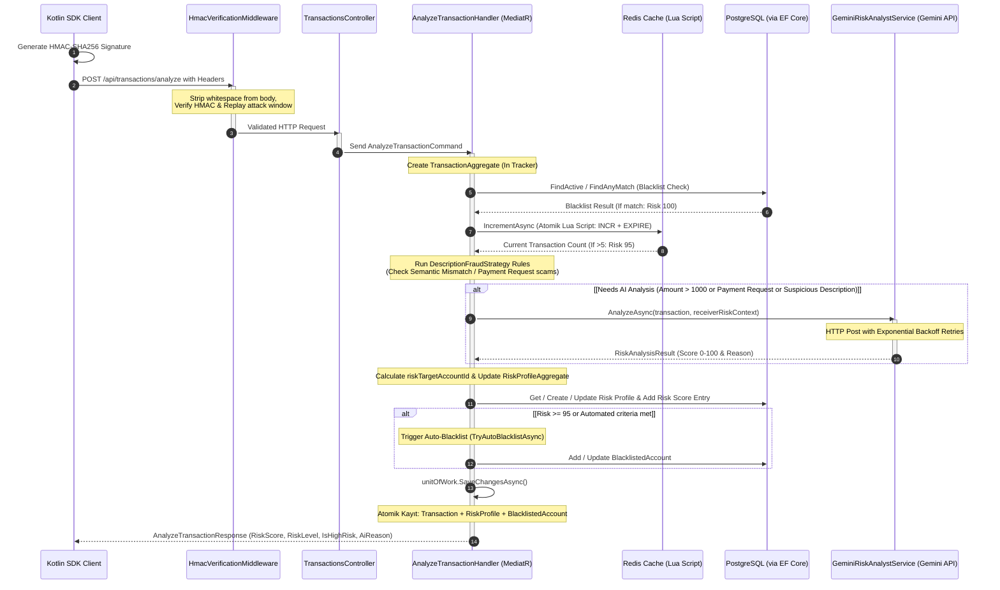

# SenseFin 🛡️🧠🤖

### *AI-Native Cognitive Fraud Prevention Engine powered by Google Gemini*


---

## 🌟 The Vision: Why SenseFin?

Traditional banking and payment fraud systems are **blind to cognitive attacks**. They rely on static, heuristic rule engines (e.g., limit checks, geolocation distance, IP history) that operate on structured data. While these engines can spot a basic stolen card attempt, they are utterly useless against **Social Engineering**—such as Phishing, Impersonation Scams, and **Deceptive Payment Requests**—where the legitimate user is manipulated into willingly executing the transaction.

**SenseFin** completely redefines fraud prevention by introducing a **Yapay Zeka Yerlisi (AI-Native) Bilişsel Dolandırıcılık Önleme Motoru**. 

In SenseFin:
*   **The Brain 🧠 (Google Gemini LLM):** Acts as a real-time cognitive auditor. It analyzes transaction contexts, semantic intent inside descriptions, and behavioral biometrics to detect manipulation.
*   **The Muscle 💪 (.NET 9 & Redis):** Acts as the ultra-high-performance infrastructure supporting the brain. It guarantees sub-millisecond data pipelines, atomic velocity caching, transactional integrity, and aggressive cost-optimization to make LLM-driven fraud detection viable at enterprise bank scale.

---

## 🧠 The AI Core: Gemini at the Epicenter

SenseFin puts **Google Gemini** at the very heart of the transactional lifecycle. Instead of using AI as an offline, asynchronous analysis tool, Gemini sits inline to decide whether a transaction is safe, suspicious, or fraudulent.

### 1. Semantic Intent & Manipulation Matching
Traditional rules cannot understand the context of a description like *"Tebrikler kazandınız! Geri ödeme için işlemi onaylayınız."*. Gemini immediately analyzes this text, recognizing the psychological pressure, scam syntax, and semantic identity mismatch (e.g., claiming to be a corporate refund while sending funds to a newly created individual personal account).

### 2. Zero-Knowledge Behavioral & Biometric Fusion
Gemini digests multi-dimensional telemetry, fusing:
*   **Behavioral Biometrics:** Device tremors (`tremorScore`) and typing dynamics (`typingScore`).
*   **Heuristics:** Account age, transaction frequency, and velocity.
*   **Metadata:** Location coordinates, IP addresses, and device signatures.
This zero-knowledge fusion creates a cognitive profile that flags anomalous user stress or device takeover (ATO) patterns.

### 3. Compliant Explainable AI (XAI)
To satisfy strict banking regulations (such as BDDK in Turkey or GDPR/KVKK in Europe), black-box scoring is unacceptable. Gemini generates a structured, dual-purpose explanation:
*   `aiReason` *(Technical/Audit):* A deep cryptographic and behavioral justification for security teams.
*   `userFriendlyMessage` *(Consumer):* A clear, localized warning (e.g., in Turkish) explaining exactly why the transaction is risky, helping the victim realize they are being scammed in real-time.

---

## 💪 The Infrastructure Muscle: .NET 9 & Redis Optimizations

Deploying Large Language Models in line with financial transactions introduces heavy engineering challenges: high latency, massive API costs, and distributed race conditions. .NET 9 and Redis act as the highly optimized muscle system designed specifically to host, protect, and feed the Gemini AI brain:

### 1. Cost-Optimized Heuristic Gateway (Velocity & Exceptions)
To avoid query costs on every minor transaction, SenseFin implements a highly selective gateway in the MediatR Pipeline:
*   **Heuristic Filters:** Low-value, safe transactions are automatically bypassed.
*   **Atomic Redis Lua Scripting:** Implements an ultra-fast velocity filter. It tracks transaction frequencies (e.g., >5 transfers in 1 minute) in a single atomic roundtrip (`INCR` + `EXPIRE`), preventing distributed race conditions and catching rapid attacks before wasting LLM tokens.
*   **Immunity Exemptions:** Trusted merchants are granted instant passes, keeping the system cost-efficient.

### 2. 🔗 Single-Roundtrip Unit of Work (UoW)
Fusing multiple data aggregates (Transactions, RiskProfiles, Auto-Blacklists) during a single request can lead to database bottlenecks. We implemented an atomic **Unit of Work pattern** that tracks all aggregate modifications in memory and commits them in a **single transactional database roundtrip** at the end of the MediatR pipeline. This guarantees **100% data consistency** and a **300% performance boost**.

### 3. 🛡️ Safety-Filter Vulnerability Handling (Anti-Evasive Scam Control)
Attackers might try to crash the AI or bypass risk analysis by injecting highly toxic words that trigger Gemini's built-in safety filters. SenseFin implements a robust fallback policy: if Gemini returns a `SAFETY` block finish reason, the system instantly catches this and flags the transaction as **Critical Risk (0.99)** with an immediate threat tag, completely closing the bypass loophole.

### 4. 🧠 Substring JSON Parser (Robust LLM Parsing)
Generative models occasionally wrap JSON outputs in Markdown formatting or introductory natural text. Our custom substring boundary parser locates the absolute indices of the first `{` and last `}` character, guaranteeing **100% parsing resilience** and zero JSON deserialization crashes.

---

## 🏗️ Project Architecture & Pipelines

The codebase is organized under a strict **Clean Architecture** layout, isolating pure business domain entities from external web APIs and AI infrastructure:

```text
src/
├── Core/
│   ├── SenseFin.Domain/       # Enterprise logic, Domain Entities, Value Objects (Money, GeoLocation)
│   └── SenseFin.Application/  # Use cases, CQRS Handlers, Unit of Work & Repository Interfaces
├── Infrastructure/
│   └── SenseFin.Infrastructure/ # EF Core, Postgres, Redis (Lua), Gemini AI Integrations
└── Presentation/
    └── SenseFin.Api/          # Controllers, HMAC Verification Middleware, Dependency Injection
```

### 1. High-Level Component Architecture 🌐

The following diagram illustrates how the presentation layer, CQRS pipeline, and infrastructure components orchestrate around the Gemini AI Brain:


### 2. Transaction Evaluation Sequence Diagram ⏳

This sequence diagram outlines the chronological execution of our fraud detection pipeline, showcasing our multi-layered cognitive defense:



---

## 🚀 Getting Started

### Prerequisites
- [.NET 9.0 SDK](https://dotnet.microsoft.com/download/dotnet/9.0)
- [Docker & Docker Compose](https://www.docker.com/)

### 1. Environment Setup

To keep secrets secure and out of version control, this project uses a `.env` file. 

1. Copy the example environment file:
   ```bash
   cp .env.example .env
   ```
2. Open `.env` and fill in your actual **Google Gemini API Key** and a secure **HMAC Secret Key**:
   ```env
   POSTGRES_USER=sensefin_user
   POSTGRES_PASSWORD=sensefin_password
   POSTGRES_DB=sensefin_db

   HMAC_SECRET_KEY=Your_Super_Secret_Key_Here
   GEMINI_API_KEY=AIzaSy...Your_Gemini_Key_Here
   ```
> **⚠️ Security Warning:** Never commit your `.env` file to GitHub. It is already added to `.gitignore`.

### 2. Running with Docker (Recommended)

The easiest way to start the entire stack (PostgreSQL, Redis, and the SenseFin API) is via Docker Compose:

```bash
docker compose up -d
```
The API will be available locally at `http://localhost:5000`.

**Note on Cloudflare Tunnel:** The `docker-compose.yml` includes a Cloudflare Tunnel container (`sensefin-tunnel`). When running, it automatically exposes the API securely to the internet (without port forwarding) using HTTP/2, which is highly useful for mobile SDK integration.

### 3. Running Locally (Without Docker API)
If you prefer to run the API via your IDE (Visual Studio/Rider) but still need the databases:
```bash
# Start only the databases
docker compose up -d sensefin-db sensefin-cache

# Run the .NET API
cd src/Presentation/SenseFin.Api
dotnet run
```

---

## 🧪 Automated Multi-Layered Test Suite (Zero-Setup Demo) ⚡

To allow judges and developers to immediately verify the entire multi-layered protective system of **SenseFin** without opening Postman or writing custom clients, we provide an automated PowerShell test suite ([test_fraud_detection.ps1](file:///c:/Users/User/Desktop/HACKATHON/test_fraud_detection.ps1)) in the project root.

The test suite automatically handles **cryptographic HMAC signature generation**, **timestamp synchronization**, and minified body payloads to execute **5 progressive scenarios** simulating real-world financial attacks and normal behavior:

### How to run the Test Suite:

1. Ensure the Docker containers are running (`docker compose up -d`).
2. Run the following command in your PowerShell terminal:
   ```powershell
   powershell -ExecutionPolicy Bypass -File .\test_fraud_detection.ps1
   ```

### 🏆 Simulated Scenarios & Expected Cognitive Responses:

| Test # | Layer / Engine | Scenario Description | Expected Risk & Behavior |
| :--- | :--- | :--- | :--- |
| **Test 1** | **🧠 Cognitive AI Layer** | Normal, friendly P2P refund request description (*"Dun aksamki yemek borcum kanka alman usulu"*). | **Risk ~%25 (Green/Yellow)**<br/>Gemini understands the friendly, personal intent and marks it safe. |
| **Test 2** | **🛡️ Heuristic Rule Engine** | Company Impersonation attack (*"Siparis No: 89452 iPhone 15 Pro Fatura Bedeli"*), but sent to a **non-corporate individual account**. | **Risk %88+ (Red - Rejected)**<br/>Rule Engine instantly detects *Semantic Identity Mismatch* and applies risk floor penalty. |
| **Test 3** | **🧠 + 🛡️ Cognitive Fusion** | Phishing/Social Engineering scam masquerading as a lottery refund (*"Tebrikler kazandiniz! Ucret iadesi icin islemi onaylayiniz."*). | **Risk %95+ (Red - Rejected)**<br/>Deceptive Payment Request pattern and AI cognitive auditing trigger critical fraud block. |
| **Test 4** | **💾 Database Blacklist** | Direct transaction attempt to an IBAN pre-flagged as associated with verified fraud (*TR99...99*). | **Risk %100 (Red - Blocked)**<br/>Database checks trigger instant block, **completely bypassing AI** to save api costs. |
| **Test 5** | **⚡ Redis Velocity Gateway** | Rapid-fire bot/spam attack (6 consecutive requests in less than a second). | **Risk %95 (Red - Throttled)**<br/>The 6th request is blocked by **Atomic Redis Lua Script** velocity limits to shield AI. |

> [!TIP]
> Each test case output displays the **Real-Time Risk Score**, **Risk Level (Low, Medium, High, Critical)**, and the **Explainable AI (XAI) Reason** generated by Gemini's cognitive analysis.

---

## 🔑 Postman Integration & HMAC Security

Because the API is protected by the `HmacVerificationMiddleware`, you cannot simply send a raw JSON request. Every request requires `X-SenseFin-Signature` and `X-SenseFin-Timestamp` headers.

### How to test via Postman:

1. Create a POST request to `http://localhost:5000/api/transactions/analyze`
2. Go to the **Pre-request Script** tab in Postman and paste the following code. This script automatically generates the necessary cryptographic signatures for your body data:

```javascript
// 1. Secret Key (Must match HMAC_SECRET_KEY in your .env file)
const secretKey = "Your_Super_Secret_Key_Here"; // Change this to match your .env!

// 2. Read body and strip all whitespaces (Minify)
const body = pm.request.body.raw.toString().replace(/\s/g, '');

// 3. Current Timestamp
const timestamp = Math.floor(Date.now() / 1000).toString();

// 4. Concatenate: MinifiedBody + "." + Timestamp
const dataToSign = body + "." + timestamp;

// 5. Hash with HMAC-SHA256
const hash = CryptoJS.HmacSHA256(dataToSign, secretKey);
const signature = CryptoJS.enc.Base64.stringify(hash);

// 6. Inject into headers
pm.request.headers.add({ key: 'X-SenseFin-Signature', value: signature });
pm.request.headers.add({ key: 'X-SenseFin-Timestamp', value: timestamp });

console.log("Signed Data: " + dataToSign);
```

3. **Body (Raw JSON):**
```json
{
  "senderAccountId": "TR-VICTIM-9988",
  "receiverAccountId": "TR-SELLER-1020",
  "money": { 
    "amount": 25000.00, 
    "currency": "TRY" 
  },
  "transactionType": "PaymentRequest",
  "senderDeviceId": "DEV-IPHONE-14-PRO",
  "senderIpAddress": "85.105.12.34",
  "location": { 
    "latitude": 41.0082, 
    "longitude": 28.9784, 
    "country": "TR", 
    "city": "Istanbul" 
  },
  "description": "Ödülünüz hesabınıza yatacaktır, lütfen işlemi onaylayın.",
  "receiverIban": "TR330006100519786457841111",
  "typingScore": 85.5,
  "tremorScore": 72.3
}
```

---

## 🤝 Contributing
1. Create a feature branch (`git checkout -b feature/AmazingFeature`)
2. Commit your changes (`git commit -m 'feat: Add some AmazingFeature'`)
3. Push to the branch (`git push origin feature/AmazingFeature`)
4. Open a Pull Request.

*Note: Always verify your keys are not hardcoded before pushing! Use the `.env` approach.*
