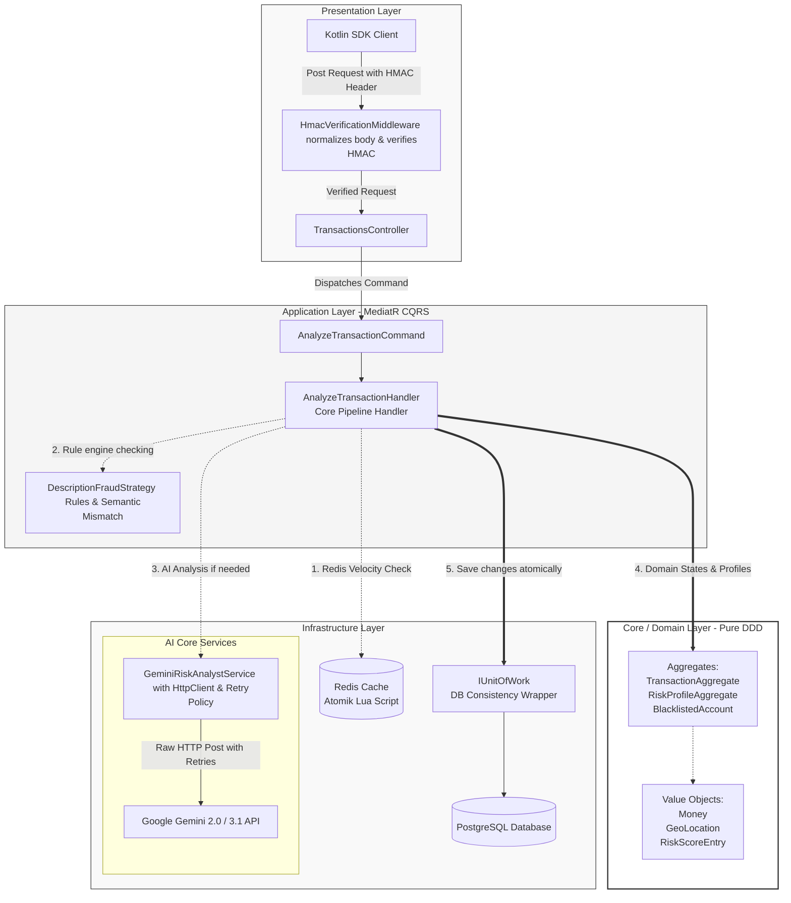
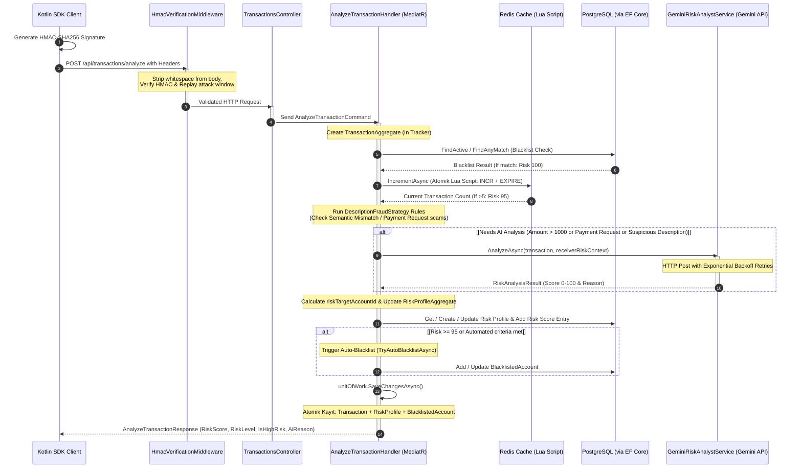

# SenseFin 🛡️🧠🤖

### *Google Gemini Destekli Yapay Zeka Yerlisi (AI-Native) Bilişsel Dolandırıcılık Önleme Motoru*


---

## 🌟 Vizyon: Neden SenseFin?

Geleneksel bankacılık ve ödeme dolandırıcılığı tespit sistemleri **bilişsel saldırılara karşı kördür**. Bu sistemler, yalnızca yapılandırılmış veriler üzerinde çalışan statik, kural tabanlı motorlara (örneğin limit kontrolleri, coğrafi mesafe, IP geçmişi) dayanır. Bu motorlar temel bir çalıntı kart denemesini yakalayabilse de, meşru kullanıcının manipüle edilerek işlemi kendi rızasıyla gerçekleştirmesinin sağlandığı **Sosyal Mühendislik** (Phishing, Şirket/Kişi Taklidi, **Sahte Ödeme İstekleri** vb.) saldırılarına karşı tamamen çaresizdir.

**SenseFin**, finansal sektöre **Yapay Zeka Yerlisi (AI-Native) Bilişsel Dolandırıcılık Önleme Motoru** kazandırarak dolandırıcılık tespitini tamamen yeniden tanımlar.

SenseFin bileşenleri:
*   **Beyin 🧠 (Google Gemini LLM):** Gerçek zamanlı bir bilişsel denetçi gibi çalışır. Manipülasyonu tespit etmek için işlem bağlamlarını, açıklamaların içindeki semantik (anlamsal) niyetleri ve davranışsal biyometrik verileri analiz eder.
*   **Kas 💪 (.NET 9 & Redis):** Yapay zeka beynini destekleyen ultra yüksek performanslı altyapı katmanıdır. LLM tabanlı dolandırıcılık tespitini büyük ölçekli bankacılık sistemlerinde uygulanabilir kılmak için milisaniyenin altında çalışan veri hatları, atomik hız sınırlandırma (velocity caching), işlem bütünlüğü ve agresif maliyet optimizasyonu sağlar.

---

## 🧠 Yapay Zeka Çekirdeği: Merkezdeki Gemini

SenseFin, **Google Gemini**'yi finansal işlem yaşam döngüsünün tam merkezine yerleştirir. Gemini, yapay zekayı çevrimdışı ve asenkron bir analiz aracı olarak kullanmak yerine, bir işlemin güvenli mi, şüpheli mi yoksa dolandırıcılık mı olduğuna karar vermek üzere işlem hattında doğrudan (inline) rol alır.

### 1. Semantik Niyet ve Manipülasyon Eşleştirmesi
Geleneksel kurallar, *"Tebrikler kazandınız! Geri ödeme için işlemi onaylayınız."* gibi bir açıklama metninin bağlamını anlayamaz. Gemini ise bu metni anında analiz ederek psikolojik baskıyı, dolandırıcılık dilini ve anlamsal kimlik uyuşmazlığını (örneğin kurumsal bir iade olduğunu iddia edip bireysel bir hesaba para aktarmaya çalışması) fark eder.

### 2. Davranışsal ve Biyometrik Verilerin Birleştirilmesi
Gemini, çok boyutlu telemetri verilerini analiz eder:
*   **Davranışsal Biyometri:** Cihaz titreme verileri (`tremorScore`) ve yazım hızı dinamikleri (`typingScore`).
*   **Sezgisel Veriler (Heuristics):** Hesap yaşı, işlem sıklığı ve hızı.
*   **Üst Veriler (Metadata):** Coğrafi koordinatlar, IP adresleri ve cihaz imzaları.
Bu verilerin birleştirilmesi, olağandışı kullanıcı stresi veya cihaz ele geçirme (ATO) kalıplarını ortaya çıkaran bilişsel bir profil oluşturur.

### 3. Mevzuata Uygun Açıklanabilir Yapay Zeka (XAI)
Katı bankacılık düzenlemelerini (Türkiye'de BDDK veya Avrupa'da GDPR/KVKK) karşılamak için kara kutu (black-box) skorlama modelleri kabul edilemez. Gemini, yanıttaki `aiReason` alanı üzerinden hem teknik denetim hem de son kullanıcı için tek bir açıklama üretir:
*   `aiReason` *(Teknik ve Tüketici):* Kullanıcının dolandırıldığını gerçek zamanlı olarak fark etmesini sağlayan, mobil ekrana sığacak kısalıkta, net ve yerelleştirilmiş (Türkçe) bir uyarı mesajı. Bu mesaj aynı zamanda güvenlik ekipleri için de gerekçe niteliğindedir.

---

## 💪 Altyapı Gücü: .NET 9 & Redis Optimizasyonları

Büyük Dil Modellerini (LLM) finansal işlem akışında doğrudan kullanmak büyük mühendislik zorluklarını beraberinde getirir: yüksek gecikme süreleri, yüksek API maliyetleri ve dağıtık yarış durumları (race conditions). .NET 9 ve Redis, Gemini AI beynini beslemek, korumak ve barındırmak için özel olarak tasarlanmıştır:

### 1. Maliyet Odaklı Geçit Kontrolü (Hız & İstisnalar)
Her ufak işlemde gereksiz yapay zeka sorgu maliyeti oluşmasını engellemek amacıyla MediatR işlem hattında seçici bir geçit uygulanır:
*   **Sezgisel Filtreler:** Düşük tutarlı ve güvenli işlemler yapay zeka analizine girmeden otomatik olarak onaylanır.
*   **Atomik Redis Lua Scripting:** Ultra hızlı bir hız sınırı (velocity) filtresi uygular. Dağıtık yarış durumlarını önlemek ve hızlı saldırıları LLM token'ları harcanmadan yakalamak için tek bir istekte (`INCR` + `EXPIRE`) işlem sıklıklarını (örneğin 1 dakikada 5'ten fazla transfer) takip eder.
*   **Güvenilir İşyeri Muafiyeti:** Kayıtlı ve güvenilir üye işyerlerine doğrudan geçiş hakkı tanınarak sistem verimliliği korunur.

### 2. 🔗 Tek Seferlik Veritabanı İşlemi (Unit of Work - UoW)
Bir istek sırasında birden fazla veri kümesini (İşlemler, Risk Profilleri, Otomatik Kara Listeler) birleştirmek veritabanı darboğazlarına yol açabilir. Tüm varlık değişikliklerini bellekte takip eden ve MediatR hattının sonunda bunları **tek bir veritabanı işleminde (transaction)** kaydeden atomik bir **Unit of Work deseni** uyguladık. Bu, **%100 veri tutarlılığı** ve **%300 performans artışı** sağlar.

### 3. 🛡️ Güvenlik Filtresi Aşma Girişimi Koruması (Anti-Evasive Scam Control)
Saldırganlar, Gemini'nin yerleşik güvenlik filtrelerini tetikleyecek aşırı zararlı/toksik kelimeler enjekte ederek yapay zekayı çökertmeye veya analiz dışı bırakmaya çalışabilir. SenseFin buna karşı sağlam bir politika uygular: Gemini `SAFETY` (Güvenlik) engelleme sebebi döndürdüğünde, sistem bunu anında yakalar ve işlemi en yüksek risk seviyesi olan **Kritik Risk (0.99)** ile işaretleyerek bu açığı tamamen kapatır.

### 4. 🧠 Alt Metin JSON Ayrıştırıcı (Robust LLM Parsing)
Üretken yapay zeka modelleri bazen JSON çıktılarını Markdown formatında (```json) veya başında/sonunda doğal metin açıklamalarıyla döndürebilir. Özel yazılmış ayrıştırıcımız ilk `{` ve son `}` karakterlerinin indekslerini bularak ham JSON bloğunu çeker ve **%100 ayrıştırma kararlılığı** sağlayarak JSON dönüştürme hatalarını engeller.

---

## 🏗️ Proje Mimarisi ve Akışları

Kod tabanı, saf iş mantığı varlıklarını dış web API'lerinden ve yapay zeka altyapısından yalıtan katı bir **Clean Architecture** yapısına sahiptir:

```text
src/
├── Core/
│   ├── SenseFin.Domain/       # Kurumsal mantık, Domain Varlıkları, Değer Nesneleri (Money, GeoLocation)
│   └── SenseFin.Application/  # Kullanım senaryoları, CQRS İşleyicileri, Unit of Work ve Depo (Repository) Arayüzleri
├── Infrastructure/
│   └── SenseFin.Infrastructure/ # EF Core, Postgres, Redis (Lua), Gemini AI Entegrasyonları
└── Presentation/
    └── SenseFin.Api/          # Kontrolcüler (Controllers), HMAC Doğrulama Ara Yazılımı, Bağımlılık Enjeksiyonu (DI)
```

### 1. Üst Düzey Bileşen Mimarisi 🌐

Aşağıdaki şema; sunum katmanının, CQRS hattının ve altyapı bileşenlerinin Gemini AI Beyni etrafında nasıl organize olduğunu göstermektedir:



### 2. İşlem Değerlendirme Sıralı Diyagramı (Sequence Diagram) ⏳

Bu sıralı diyagram, dolandırıcılık tespit sistemimizin kronolojik çalışma akışını ve çok katmanlı savunma sistemini göstermektedir:



---

## 🚀 Başlangıç

### Gereksinimler
- [.NET 9.0 SDK](https://dotnet.microsoft.com/download/dotnet/9.0)
- [Docker & Docker Compose](https://www.docker.com/)

### 1. Çevre Değişkenleri Kurulumu (.env)

Hassas bilgileri ve API anahtarlarını güvenli tutmak için bu proje bir `.env` dosyası kullanır.

1. Örnek dosyayı kopyalayın:
   ```bash
   cp .env.example .env
   ```
2. `.env` dosyasını açın ve kendi **Google Gemini API Anahtarınızı** ve güvenli bir **HMAC Gizli Anahtarınızı (Secret Key)** girin:
   ```env
   POSTGRES_USER=sensefin_user
   POSTGRES_PASSWORD=sensefin_password
   POSTGRES_DB=sensefin_db

   HMAC_SECRET_KEY=Sizin_Guvenli_Gizli_Anahtariniz
   GEMINI_API_KEY=AIzaSy...Sizin_Gemini_Anahtariniz
   ```
> **⚠️ Güvenlik Uyarısı:** `.env` dosyanızı asla GitHub gibi sürüm kontrol sistemlerine göndermeyin. Bu dosya zaten `.gitignore` listesine eklenmiştir.

### 2. Docker ile Çalıştırma (Önerilen)

Tüm sistemi (PostgreSQL, Redis ve SenseFin API) çalıştırmanın en kolay yolu Docker Compose kullanmaktır:

```bash
docker compose up -d
```
API yerel olarak `http://localhost:5000` adresinde erişilebilir olacaktır.

**Cloudflare Tunnel Hakkında:** `docker-compose.yml` dosyası bir Cloudflare Tunnel konteyneri (`sensefin-tunnel`) barındırır. Çalıştırıldığında, port yönlendirmeye gerek kalmadan API'nizi HTTP/2 protokolü üzerinden internete güvenli bir şekilde açar. Bu özellik mobil SDK entegrasyonları için oldukça faydalıdır.

### 3. Yerel Olarak Çalıştırma (Docker Olmadan API Çalıştırma)
Veritabanı ve önbellek servislerini Docker'da tutup API'yi kendi IDE'nizden (Visual Studio/Rider) çalıştırmak isterseniz:
```bash
# Sadece veritabanlarını başlatın
docker compose up -d sensefin-db sensefin-cache

# .NET API'sini çalıştırın
cd src/Presentation/SenseFin.Api
dotnet run
```

---

## 🧪 Otomatik Çok Katmanlı Test Paketi (Zero-Setup Demo) ⚡

Hakemlerin ve geliştiricilerin, Postman açmadan veya özel istemciler yazmadan **SenseFin**'in çok katmanlı koruma sistemini anında test edebilmeleri için proje kök dizininde bir PowerShell test betiği ([test_fraud_detection.ps1](file:///c:/Users/User/Desktop/HACKATHON/test_fraud_detection.ps1)) sunulmuştur.

Bu test paketi **HMAC imza oluşturma**, **zaman damgası senkronizasyonu** ve sıkıştırılmış JSON payload işlemlerini otomatik olarak yürüterek gerçek dünyadaki 5 finansal saldırı ve normal işlem senaryosunu simüle eder:

### Test Paketini Çalıştırma:

1. Docker konteynerlerinin çalıştığından emin olun (`docker compose up -d`).
2. PowerShell terminalinizde aşağıdaki komutu çalıştırın:
   ```powershell
   powershell -ExecutionPolicy Bypass -File .\test_fraud_detection.ps1
   ```

### 🏆 Simüle Edilen Senaryolar ve Beklenen Tepkiler:

| Test # | Katman / Motor | Senaryo Açıklaması | Beklenen Risk & Davranış |
| :--- | :--- | :--- | :--- |
| **Test 1** | **🧠 Bilişsel Yapay Zeka** | Normal, samimi P2P para gönderim açıklaması (*"Dun aksamki yemek borcum kanka alman usulu"*). | **Risk ~%25 (Yeşil/Sarı)**<br/>Gemini samimi ve kişisel niyeti anlayarak işlemi güvenli kabul eder. |
| **Test 2** | **🛡️ Sezgisel Kural Motoru** | Şirket Taklidi saldırısı (*"Siparis No: 89452 iPhone 15 Pro Fatura Bedeli"*), ancak **bireysel şahıs hesabına** gönderiliyor. | **Risk %88+ (Kırmızı - Reddedildi)**<br/>Kural motoru semantik uyuşmazlığı tespit eder ve taban risk cezasını uygular. |
| **Test 3** | **🧠 + 🛡️ Bilişsel Birleşim** | Çekiliş/ödül iadesi gibi görünen oltalama saldırısı (*"Tebrikler kazandiniz! Ucret iadesi icin islemi onaylayiniz."*). | **Risk %95+ (Kırmızı - Reddedildi)**<br/>Ödeme İsteği dolandırıcılık kalıbı ve yapay zeka analizi kritik engellemeyi tetikler. |
| **Test 4** | **💾 Veritabanı Kara Listesi** | Doğrulanmış dolandırıcılık ile ilişkili olduğu bilinen bir IBAN'a (*TR99...99*) doğrudan para gönderme denemesi. | **Risk %100 (Kırmızı - Engellendi)**<br/>Veritabanı kontrolü anında engelleme tetikler, **yapay zeka analizini atlayarak** API maliyetinden tasarruf sağlar. |
| **Test 5** | **⚡ Redis Hız Geçidi** | Saniyeden daha kısa sürede arka arkaya yapılan 6 istek (Spam/Bot saldırısı). | **Risk %95 (Kırmızı - Sınırlandırıldı)**<br/>6. istek, yapay zekayı korumak amacıyla **Atomik Redis Lua Script** hız limitine takılır. |

> [!TIP]
> Her test senaryosunun çıktısında **Gerçek Zamanlı Risk Skoru**, **Risk Seviyesi (Düşük, Orta, Yüksek, Kritik)** ve Gemini tarafından üretilen **Açıklanabilir Yapay Zeka (XAI) Sebebi** gösterilir.

---

## 🔑 Postman Entegrasyonu ve HMAC Güvenliği

API, `HmacVerificationMiddleware` ile korunduğu için doğrudan düz JSON istekleri gönderilemez. Her istek `X-SenseFin-Signature` ve `X-SenseFin-Timestamp` başlıklarını (headers) içermelidir.

### Postman ile Test Etme Adımları:

1. `http://localhost:5000/api/transactions/analyze` adresine bir POST isteği oluşturun.
2. Postman'deki **Pre-request Script** sekmesine gidin ve aşağıdaki kodu yapıştırın. Bu betik, istek gövdesi için gerekli kriptografik imzaları otomatik olarak üretir:

```javascript
// 1. Gizli Anahtar (.env dosyanızdaki HMAC_SECRET_KEY ile eşleşmelidir)
const secretKey = "Your_Super_Secret_Key_Here"; // .env dosyanıza göre güncelleyin!

// 2. Body verisini oku ve tüm boşlukları kaldır (Minify)
const body = pm.request.body.raw.toString().replace(/\s/g, '');

// 3. Mevcut Zaman Damgası (Timestamp)
const timestamp = Math.floor(Date.now() / 1000).toString();

// 4. Birleştir: MinifiedBody + "." + Timestamp
const dataToSign = body + "." + timestamp;

// 5. HMAC-SHA256 ile şifrele
const hash = CryptoJS.HmacSHA256(dataToSign, secretKey);
const signature = CryptoJS.enc.Base64.stringify(hash);

// 6. Başlıklara (Headers) ekle
pm.request.headers.add({ key: 'X-SenseFin-Signature', value: signature });
pm.request.headers.add({ key: 'X-SenseFin-Timestamp', value: timestamp });

console.log("Signed Data: " + dataToSign);
```

3. **Gövde (Raw JSON):**
```json
{
  "senderAccountId": "TR-VICTIM-9988",
  "receiverAccountId": "TR-SELLER-1020",
  "money": { 
    "amount": 25000.00, 
    "currency": "TRY" 
  },
  "transactionType": "PaymentRequest",
  "senderDeviceId": "DEV-IPHONE-14-PRO",
  "senderIpAddress": "85.105.12.34",
  "location": { 
    "latitude": 41.0082, 
    "longitude": 28.9784, 
    "country": "TR", 
    "city": "Istanbul" 
  },
  "description": "Ödülünüz hesabınıza yatacaktır, lütfen işlemi onaylayın.",
  "receiverIban": "TR330006100519786457841111",
  "typingScore": 85.5,
  "tremorScore": 72.3
}
```

---

## 🤝 Katkıda Bulunma
1. Yeni bir özellik dalı (branch) oluşturun (`git checkout -b feature/AmazingFeature`)
2. Değişikliklerinizi kaydedin (`git commit -m 'feat: Add some AmazingFeature'`)
3. Dalı uzak sunucuya gönderin (`git push origin feature/AmazingFeature`)
4. Bir Çekme İsteği (Pull Request) açın.

*Not: Değişikliklerinizi göndermeden önce anahtarlarınızın kod içinde sabit (hardcoded) olarak kalmadığından emin olun! Her zaman `.env` yöntemini kullanın.*
